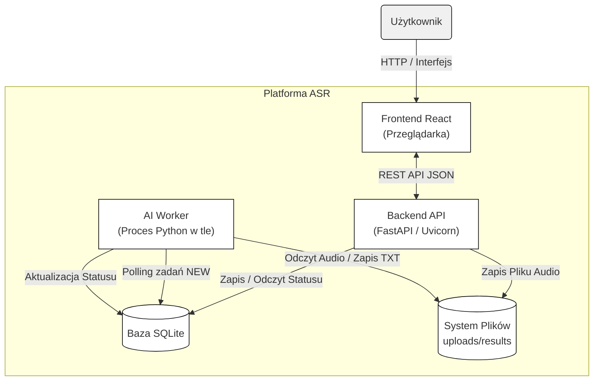

# ASR Web Application: AI-Powered Speech Analysis System

## 1. Project Description

This repository contains the source code for a web application developed as part of an engineering thesis. The project aims to create a scalable system for automatic speech transcription and analysis using the **OpenAI Whisper** model.

The system features an asynchronous architecture, decoupling the presentation layer (Frontend), business logic layer (API), and computational layer (AI Worker). Key features include:

* **Model Selection:** Support for various Whisper model sizes (from `tiny` to `large`).
* **Background Processing:** Asynchronous handling of audio files to ensure UI responsiveness.
* **WER Calculation:** Automated calculation of **Word Error Rate** against a provided Ground Truth text.
* **Real-time Monitoring:** Live progress tracking of the analysis pipeline.

## 2. System Architecture (Flow Diagram)

The following diagram (Mermaid.js standard) illustrates the asynchronous data flow within the application:



## 3. Technical Requirements

To ensure proper environment functionality, especially for AI modules, the following hardware and software resources are required.

### Hardware

* **CPU:** Multi-core processor (min. 4 cores recommended) for API and Frontend operations.
* **RAM:** Minimum 8 GB (16 GB Recommended).
* **GPU (Highly Recommended):** NVIDIA GPU with CUDA support.
    * For `base`/`small` models: min. 2 GB VRAM.
    * For `medium` model: min. 5 GB VRAM.
    * For `large` model: min. 10 GB VRAM.
* *Note:* Without a GPU, calculations will be performed on the CPU, drastically increasing analysis time.

### Software

* **Operating System:** Linux (Ubuntu 20.04+) or Windows with **WSL 2** enabled (recommended).
* **Python:** Version 3.10 or newer.
* **Node.js:** LTS Version (v18+).
* **FFmpeg:** System-level dependency required for audio processing by Whisper.

## 4. Installation and Execution Guide

The project consists of two independent parts: Backend (Python) and Frontend (React).

### Step A: Backend Configuration

1.  Ensure `ffmpeg` is installed on your system:

    ```bash
    sudo apt update && sudo apt install ffmpeg
    ```

2.  Navigate to the backend directory and create a virtual environment:

    ```bash
    cd backend
    python3 -m venv venv
    source venv/bin/activate
    ```

3.  **Install PyTorch with CUDA support**
    Standard installation via `requirements.txt` often fetches the CPU-only version. To utilize the GPU, run this first:

    ```bash
    pip install torch torchvision torchaudio --index-url [https://download.pytorch.org/whl/cu118](https://download.pytorch.org/whl/cu118)
    ```

    *(Match the CUDA version to your drivers; cu118 or cu121 are usually safe choices).*

4.  Install remaining dependencies:

    ```bash
    pip install -r requirements.txt
    ```

### Step B: Frontend Configuration

1.  Open a new terminal, navigate to the frontend directory:

    ```bash
    cd frontend
    ```

2.  Install JavaScript dependencies:

    ```bash
    npm install
    ```

### Step C: Running the System

The system requires running three independent processes in three separate terminals.

**Terminal 1: Backend API**

```bash
cd backend
source venv/bin/activate
uvicorn main:app --reload
```

The API will be available at: http://localhost:8000

**Terminal 2: AI Worker**

```bash
cd backend
source venv/bin/activate
python worker.py
```

The Worker will start listening for new tasks in the database.

**Terminal 3: Frontend**

```bash
cd frontend
npm start
```

The application will launch in your browser at: http://localhost:3000

## 5. Directory Structure

Below is a description of key directories in the project to facilitate code navigation.

* **`/backend`** – Server and computational logic.
    * `main.py` – API Entry point (FastAPI). HTTP request handling.
    * `worker.py` – Background processing logic. Handles Whisper model, task queue, and WER calculation.
    * `models.py` – Database models definitions (SQLAlchemy).
    * `database.py` – SQLite database connection configuration.
    * `requirements.txt` – Python dependencies list.

* **`/frontend`** – Presentation layer (React).
    * `/src` – React components source code.
    * `package.json` – Node.js dependencies list.

* **`/uploads`** – Local Storage.
    * Raw audio files uploaded by users are stored here.
    * *Note:* This directory is ignored by git (`.gitignore`).

* **`/results`** – Results Storage.
    * The worker saves text files `.txt` with completed transcriptions here.
    * *Note:* This directory is ignored by git (`.gitignore`)
